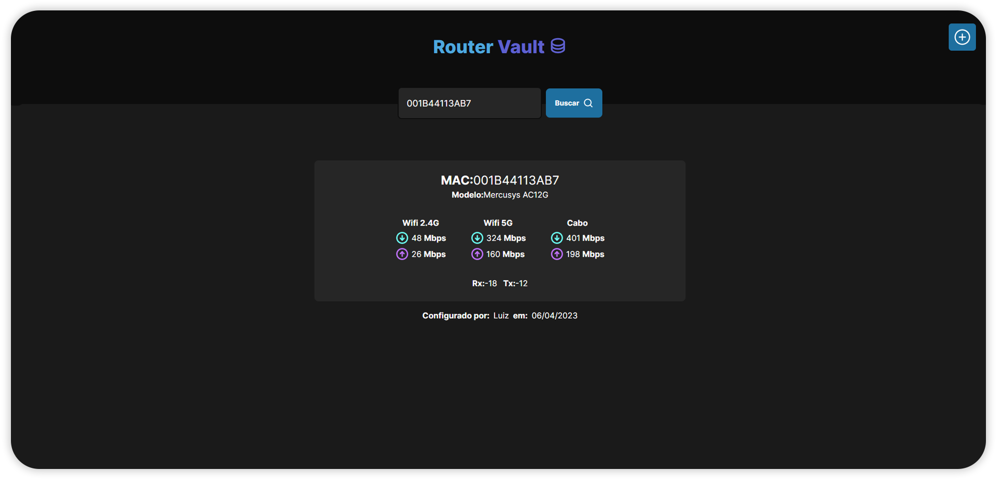

<div id="top"></div>

<!-- PROJECT LOGO -->
<br />
<div align="center">
  <a href="https://github.com/luizfranzon/router-vault.git">
    
  </a>

<h3 align="center">Router Vault</h3>

  <p align="center">
    A router database to save the tested network devices at my work.
</div>



### Built With

* [axios](https://axios-http.com/ptbr/docs/intro)
* [NextJS](https://nextjs.org/)
* [Prisma](https://www.prisma.io/)
* [TypeScript](https://www.typescriptlang.org/)
* [TailwindCSS](https://tailwindcss.com/)
* [phosphor-react](https://phosphoricons.com/)

<!-- GETTING STARTED -->
## Getting Started

**1- Clone this repository:**
```bash
git clone https://github.com/luizfranzon/router-vault.git && cd App
```
**2- Install dependencies:**
```bash
npm install
```
**3- Start the project:**
```bash
npm run dev
```
<p align="right">(<a href="#top">back to top</a>)</p>
